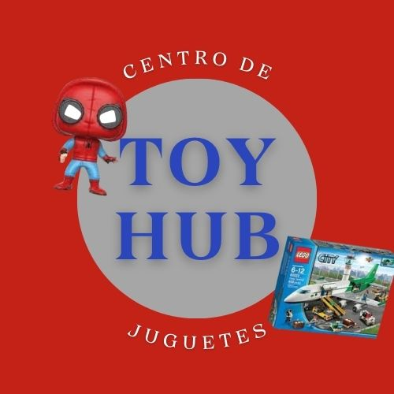
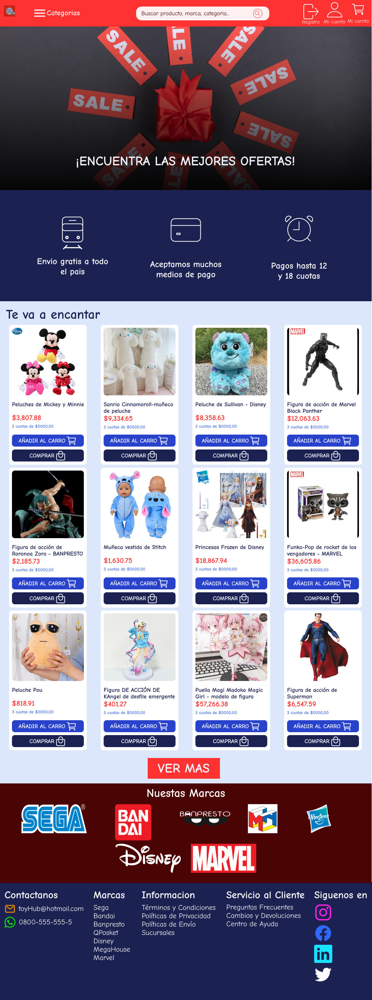
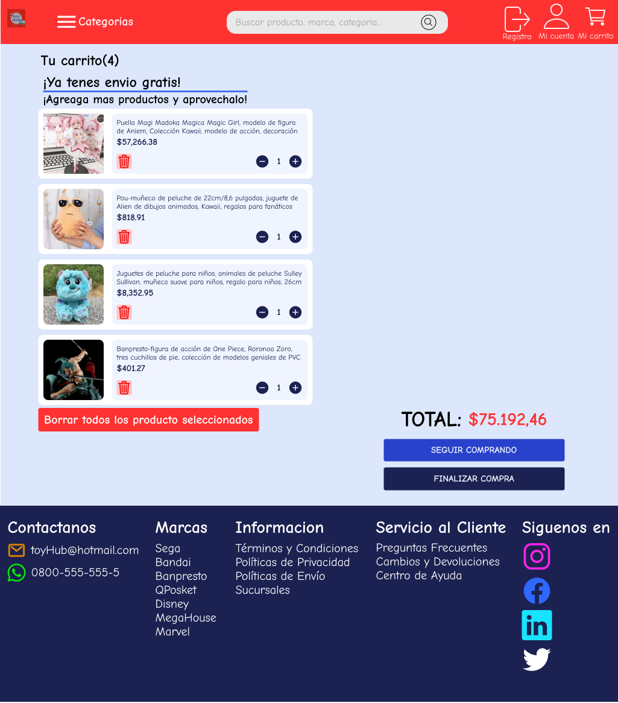
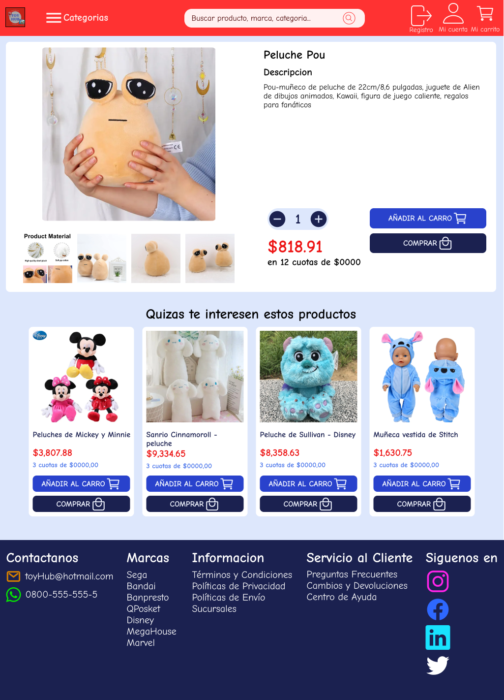
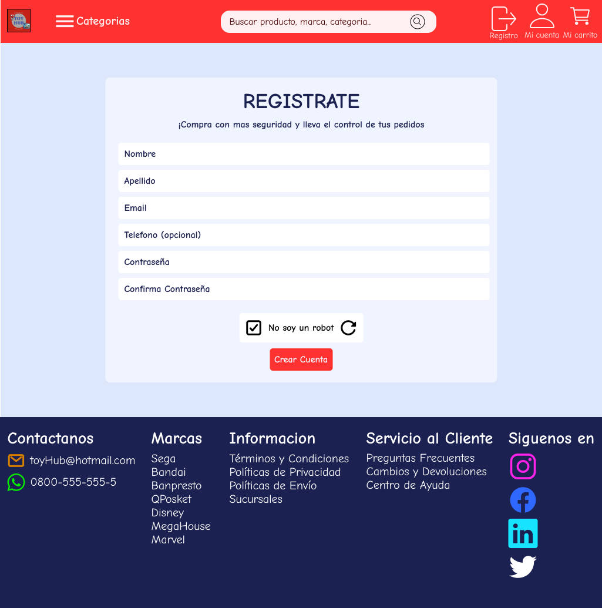

## Grupo_6_ToyHub - Equipo

- CLAUDIA DANIELA ORTIZ CIL [@DanielaOC](https://github.com/DanielaOC)
🌟 Mi nombre es Daniela, tengo 43 años, soy Tecnico en Gestión Contable e Impositiva👩‍💼.Soy de Jujuy, tengo dos hermosos hijos👩‍👦‍👦, en estos momentos soy ama de casa🏠. Me gusta escuchar musica🎵 y cocinar🍳.

- EVELYN NAHILA RAMOS [@Evelyn027](https://github.com/Evelyn027)
🌟Me dicen Elyn por mi nick de videojuegos, pueden llamarme asi!, tengo 25 años. Soy estudiante de la Tec. Universitaria en Desarrollo Integral de Videojuego👩‍🎓. Me gusta jugar🎮, leer📕, estudiar y a veces hacer ejercicios🏋️‍♀️ sino ver series🎦 jeje.

- ALFREDO ALEJANDRO QUISPE [@Flirodev](https://github.com/Flirodev)
🌟Mi nombre es alejandro tengo 25 años, soy estudiante de la Tec. Universitaria en Desarrollo Integral de Videojuegos👨‍🎓. Ademas de eso trabajo reparando celulares, pc, y basicamente todo lo que tenga q ver con tecnologia👨‍💻, me gusta hacer ejercicio🏃‍♂️, escuchar musica🎵 y jugar juegos🎮.

- ELIAS EZEQUIEL SOLIS [@elias38470](https://github.com/elias38470)
🌟Mi nombre es Elias, tengo 30 años. Soy estudiante de la carrera Analista Programador Universitario. Ademas de ser estudiante de programacion tengo hobbies como el futbol y andar en bicicleta. 

- MATIAS GABRIEL ORTEGA [@MatiasGrrrOrtega](https://github.com/MatiasGrrrOrtega)
🌟Pueden llamarme "Papulo", es mi apodo, o Matias. Tengo 25 años. Soy de Jujuy, Argentina. Estudio Desarrollo de Videojuegos👨‍🎓. Me gusta hacer ejercicio🏃‍♂️, el futbol⚽, cocinar👨‍🍳 y jugar videojuegos🎮. Mi sueño es ser Front-End Developer.

## Asignación de Tareas
- [TRELLO](https://trello.com/b/cHFWaSec/toyhub)

# ¡Bienvenido a Toy Hub! 🧸

Bienvenido a Toy Hub , el lugar perfecto donde la magia cobra vida y la imaginación se desborda. En nuestra tienda, nos apasiona ofrecerte una cuidada selección de muñecos para dos públicos muy especiales: padres de familia que buscan el compañero de juegos ideal para sus hijos y adultos coleccionistas que desean agregar piezas únicas a su tesoro.

## Oferta de Productos y Servicios👌

- **🚚Envíos Gratis a Todo el País**: Recibe tus muñecos favoritos en la puerta de tu hogar sin costos adicionales. Queremos que tu experiencia de compra sea sin preocupaciones, desde la selección hasta la entrega.

- **💰Múltiples Medios de Pago**: Ofrecemos diversos métodos de pago seguros y convenientes. Paga con tarjeta de crédito, débito o elige entre otras opciones para una transacción sin complicaciones.

- **⏰Cuotas de 12 y 24**: Haz que obtener el muñeco perfecto sea accesible con nuestras opciones de pago a plazos. Elige entre cuotas de 12 o 24 meses y lleva a casa tus muñecos favoritos sin comprometer tu presupuesto.

## Publico Objetivo

- **👪Padres de Familia**: Encuentra juguetes seguros, educativos y emocionantes para tus hijos. Nuestra tienda ofrece muñecos que estimulan la creatividad y el desarrollo de habilidades mientras brindan diversión duradera.

- **🧑Adultos Coleccionistas**: Para los entusiastas de la colección, ofrecemos muñecos exclusivos y de edición limitada. Descubre piezas únicas que agregarán un toque especial a tu colección.

En Toy Hub, nos esforzamos por brindar una experiencia de compra excepcional, con atención a la calidad, la diversidad y la satisfacción del cliente. Explora nuestro catálogo y encuentra el muñeco perfecto para cada ocasión.

¡Gracias por elegirnos como tu destino para la magia de los muñecos! ✨

# Referencias de mercado

 - [AliExpress](https://es.aliexpress.com/) : Esta pagina es de referencia porque cuenta con un Catalogo Extenso, con una amplia gama de productos. Contiene un Sistema de Busqueda eficiente, que facilita a los usuarios la busqueda de productos. El Proceso de Pago asegura transacciones seguras y confiables.
 
 - [FireWolf](https://www.firewolf.com.ar/) : Esta pagina es de referencia porque tiene un Diseño Simple y Atractivo, de interfaz visualmente agradable y facil de navegar.

 - [Jugueteria Pizzico](https://www.jugueteriapizzico.com/) : Esta pagina es de referencia porque es una empresa familiar que ofrece los mejores productos ,tiene una amplia variedad y ofrece formas de pago accesibles y envios gratuitos.
 
 - [El mundo del juguete](https://www.elmundodeljuguete.com.ar/) : Esta pagina es de referencia porque la pagina es viasualmente atractiva, podes comprar desde tu hogar ,posee atencion personalizada , reciben todos los medios de pago.

 - [Mi jugueteria](https://mijugueteria.ar/s) : Esta pagina es de referencia porque cuenta con una organización clara de juguetes por categoria. Destaca las opciones de pago y el envio gratuito. El Registro de Usuario es simple y con multiple opciones para facilitarle al usuario.

## Screenshots - Pages
- [FIGMA](https://www.figma.com/file/TdAJzFar6fQWVcr6kn8MEp/TOYHUB-GRUPO6-FIGMA?type=design&node-id=0-1&mode=design&t=4OJ04dgP2LyKaIqt-0)

**Home**

**Carrito de compras**

**Detalles de producto**

**Formulario de registro**

**Fomulario de inicio de sesion**

**Añadir un producto (en proceso...)**

**Edicion de producto (en proceso...)**

